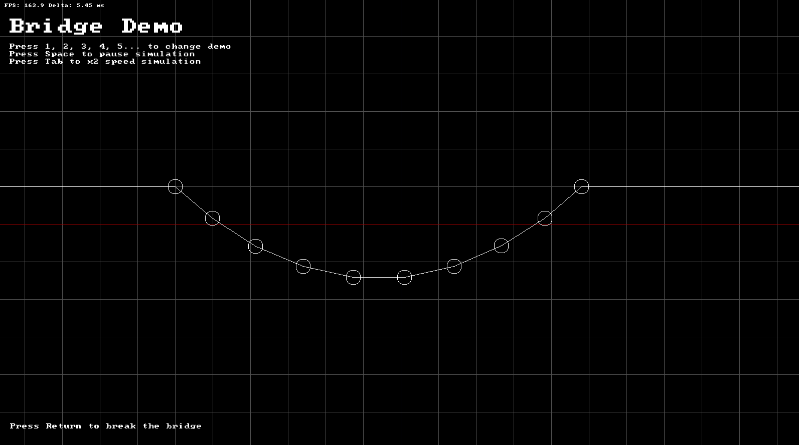
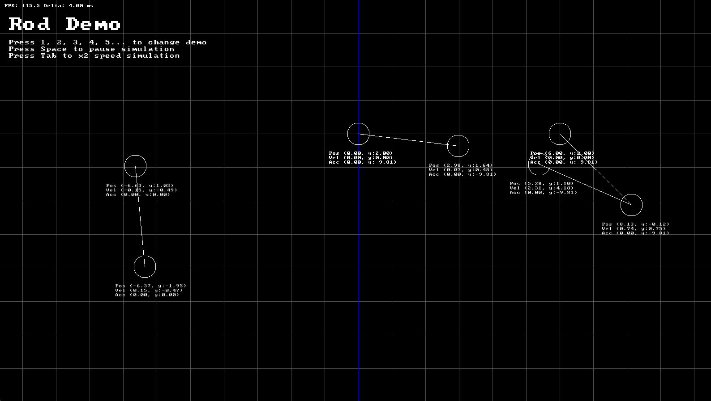

# Brise

A lightweight 2D mass-aggregate physics engine written in C++20, designed for games and simulations.

## Features

- **Particle simulation** — position, velocity, acceleration with configurable mass and damping
- **Force generators** — gravity, springs, anchored springs, bungee cords, buoyancy
- **Collision resolution** — iterative contact resolver with restitution and interpenetration correction
- **Constraints** — cables (max-length) and rods (fixed-length)
- **Fixed timestep** — frame accumulator for stable, deterministic simulation (default 120 Hz)
- **Extensible** — plug in custom force generators and contact generators via abstract interfaces
- **No external dependencies** — pure C++20 for the physics core

## Getting Started

### Prerequisites

- CMake 3.16+
- A C++20-compatible compiler (GCC 10+, Clang 12+, MSVC 2019+)

### Build

```bash
git clone --recursive https://github.com/thomascsigai/Brise.git
cd Brise
cmake -B build
cmake --build build
```

To build without the sandbox demo:

```bash
cmake -B build -DBRISE_BUILD_SANDBOX=OFF
cmake --build build
```

### Integrate into your project

Add Brise as a subdirectory in your `CMakeLists.txt`:

```cmake
add_subdirectory(Brise)
target_link_libraries(your_target PRIVATE brise)
```

Include the main header:

```cpp
#include <Brise/World.h>
```

## Usage

### Creating a world and particles

```cpp
#include <Brise/World.h>

// Create a world with a fixed 120 Hz timestep
Brise::World world(100);

// Add a particle: position, mass, damping
Brise::Particle& p = world.AddParticule({0.0f, 10.0f}, 1.0f, 0.99f);
p.SetVelocity({5.0f, 0.0f});

// Simulation loop
float deltaTime = 1.0f / 60.0f;
while (running) {
    world.Update(deltaTime);
}
```

### Applying forces

```cpp
#include <Brise/PForceGen.h>

// Anchored spring: connects a particle to a fixed world point
Brise::Vec2 anchor = {0.0f, 0.0f};
Brise::AnchoredParticleSpring spring(anchor, /*k=*/10.0f, /*restLength=*/2.0f);
world.AddForceGenToRegistry(&p, &spring);

// Buoyancy: simulates a particle floating in liquid
Brise::ParticleBuoyancy buoyancy(/*maxDepth=*/0.5f, /*volume=*/1.0f,
                                  /*waterHeight=*/0.0f, /*liquidDensity=*/1000.0f);
world.AddForceGenToRegistry(&p, &buoyancy);
```

### Constraints

```cpp
#include <Brise/PLinks.h>

// Cable: keeps two particles within a maximum distance
Brise::ParticleCable cable;
cable.particles[0] = &p1;
cable.particles[1] = &p2;
cable.maxLength    = 3.0f;
cable.restitution  = 0.3f;
world.AddContactGenerator(&cable);

// Rod: maintains a fixed distance between two particles
Brise::ParticleRod rod;
rod.particles[0] = &p1;
rod.particles[1] = &p2;
rod.length        = 2.0f;
world.AddContactGenerator(&rod);
```

## Sandbox

The sandbox is an interactive demo application built with SDL3 that showcases the engine's capabilities. Switch between demos using keys **1–0**.

| | |
|---|---|
|  |  |

| Key | Demo | Description |
|-----|------|-------------|
| `1` | Particles | Click to spawn falling particles |
| `2` | Ballistics | Projectile trajectories |
| `3` | Springs | Spring and bungee force visualisation |
| `4` | Buoyancy | Objects floating in liquid |
| `5` | Collision | Elastic, inelastic and infinite-mass collisions |
| `6` | Resting | Particles stacking under gravity |
| `7` | Cables | Rope-like max-length constraints |
| `8` | Rods | Rigid fixed-length constraints |
| `9` | Cube | 3D-looking structure built from rods |
| `0` | Bridge | Interactive bridge — press `Return` to break cables |

**Global controls:** `Space` pause/unpause · `Tab` 2× speed · `Click` spawn particle

## Architecture

```
include/Brise/
├── Vec2.h          # 2D vector math
├── Particle.h      # Core particle entity
├── PForceGen.h     # Force generator interfaces and implementations
├── PContact.h      # Contact representation and resolution
├── PLinks.h        # Cable and rod constraints
└── World.h         # Main simulation container
```

## License

[MIT](LICENSE) © 2026 Thomas Csigai
